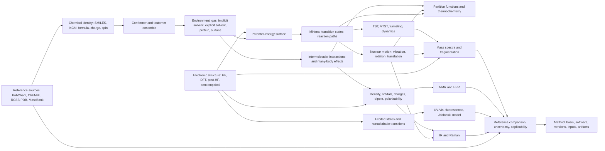

# Computational chemistry domain graph

This graph is the design backbone for Q2SC. It separates chemical identity,
physical models, numerical methods, observables, spectra, and validation so a
UI label cannot silently imply a calculation that was not performed.

## Core invariants

1. A calculation result is attached to a precise molecular state: connectivity,
   stereochemistry, protonation, tautomer, charge, spin, and conformer.
2. Every observable records method, basis, environment, software version,
   convergence state, and numerical settings.
3. A spectrum is a post-processing product of physical transitions. It is not
   interchangeable with orbital energies or a generic ML curve.
4. Condensed-phase and biomolecular claims require explicit environment
   provenance. A gas-phase single conformer is never labeled as a solution or
   protein result.
5. Reference data is immutable source evidence. Normalized records retain the
   source identifier and URL.
6. Surrogate models may accelerate a validated workflow, but they never replace
   the level-of-theory label of the data used to train them.

## Source map

- Cramer, chapters 1, 8-15: PES, DFT, spectroscopic properties,
  thermochemistry, condensed phases, QM/MM, excited states, and kinetics.
- Jensen, chapters 3-15: electronic structure, basis sets, molecular
  properties, optimization, statistical mechanics, simulation, and solvation.
- Han and Chu, chapters 1-9: transition-state theory, tunneling,
  nonadiabatic dynamics, saddle regions, and reduced PES models.

The page-oriented source text is available in `docs/books/`. Equations and
figures must still be checked against the original PDFs.
